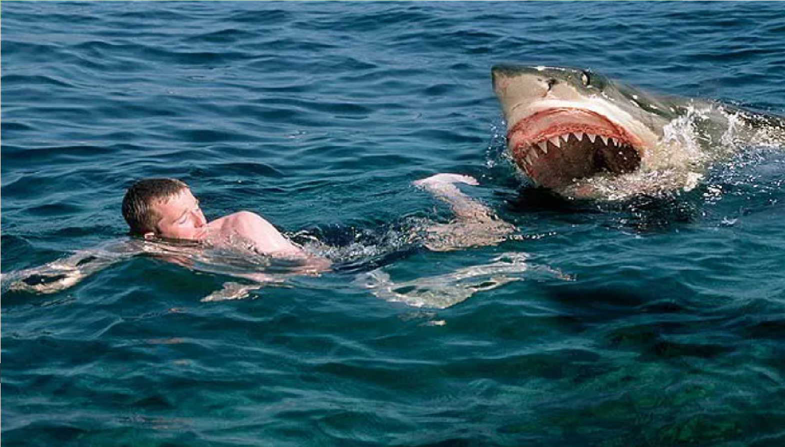
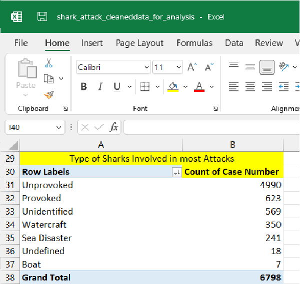

# **Global Shark Attack File Data Analysis Case Study**
## Author:          Aftab Ahmad
## Date:            10 April, 2024
## Contact:         aftabajk@gmail.com
# **``Introduction``**:
The marine environment offers a captivating and exhilarating setting for various human activities, ranging from surfing, fishing and swimming  to engaging in recreational games. However, amidst the allure of the marine site, there exists a potential danger zone marked by the presence of marine mammals, particularly sharks, which occasionally pose a threat to human safety. Understanding and analyzing the major occurrences and trends of shark attacks across the globe is essential in order to mitigate these risks effectively. By delving into the depths of shark attack data analysis, this study aims to shed light on the patterns and characteristics of these incidents, providing valuable insights that can help safeguard human interactions with marine mammals while preserving the delicate balance of our ecosystems.

# Scenario
In the realm of data analysis, one captivating domain that requires thorough exploration is the occurrence and trends of shark attacks worldwide. As a data analyst, I embark on an intriguing journey to unravel the mysteries surrounding these incidents. With a keen focus on multiple countries, my aim is to decipher the patterns and characteristics of major shark attacks, while paying particular attention to the types of sharks that frequently engage in such encounters. By meticulously examining and interpreting the available data, I hope to shed light on the complex dynamics between humans and sharks, thus contributing to a deeper understanding of these occurrences. 

# **``Ask``**
### Key Task ###
In the context of the marine landscape, how can effective measures be implemented to minimize the risk of shark encounters and ensure the safety of humans?

### Objectives ###
The main objective needs to be analyzed to pave the way for informed decision-making and the implementation of effective measures to mitigate the risks associated with shark attacks on a global scale. The key findings will be crucial for humans who somehow make activities in marine environments. One of the objectives is to provide a clear picture of the actual threat presented by sharks to humans.

# **``Prepare``**
### Source of Data:
The data was gathered for analysis from the Global Shark Attack File website. The Link for accessing this data is  https://sharkattackfile.net/incidentlog.htm  . This is public data that analysts can use to explore ways to protect humans from shark attacks.
### Data Description:
Global Shark Attack File data abbreviated as GSAF is created by a group of physicians, surgeons, and medical examiners.  GSAF contributors and users quickly grew to include marine biologists and shark behaviorists. The GSAF has been maintained by SRI since 1992 and managed since 2010 by SRI team member Ralph Collier, a respected thought leader in shark conservation who has studied shark/human interactions for more than 40 years.

- ### The Data Integrity
The data used for this project meets the ROCC standards of integrity. The Global Shark Attack File is a continuously updated online resource considered reliable as it provides a world map of encounters categorized by provoked vs. unprovoked, incidents involving boats, air & sea disasters and questionable incidents. **One thing needs to be noted for the dataset that the cases of the year 2023 and 2024 have not yet been registered.**

# **``Process``**:
Global Shark Attack File (GSAF) is maintained in Excel file format. It will be better option to clean and make analysis using PowerBI tools. Also, I will thoroughly make analysis using a pivot table.

### Data Exploration.
To take data into Power Query Editor I opened Microsoft Excel and navigated to the Data tab. After take into Power Query Editor data has been thoroughly checked to ensure the accuracy and integrity of the dataset by verifying the column names. 
During data exploration Initially, data set contains 6968 rows and 23 columns. I thoroughly checked each column of the data set there were lot of inconsistencies need to be handled.

### Data Cleaning.
•	Removed inconsistencies from data and replace inappropriate data.
•	Changed the data types of columns where required.
•	There were no duplicate values in the dataset but action removing duplicated is applied.
•	Removed the 12 unwanted columns from the dataset. 
•	Hundreds of inconsistencies removed from species column.
 
# **``Analyze``**
In this step I analyzed the cleaned and transformed data, to gain a better understanding of its characteristics and patterns. These insights helped me answer the stakeholder questions below.
- **Question**:  How annual members and casual riders use Cyclistic bikes differently?
### Total Number of Registered Cases

There are a total of 6798 recorded cases in the Global Shark Attack File (GSAF).  Data for the 1500s is also available.   It has been observed that not many cases were reported before the 1900s.  It has also been observed that the cases were not included in the GSAF file since September 2022. These unregistered cases have been excluded from the analysis.
### Type of Sharks Involved in most Attacks

In most shark attacks where the species are not identified. This is because the victims were in unknown locations or people / authorities did not know which type of shark lived there. Total count of unknown species are 4467. As per GSAF a very small percentage of shark species, about two dozen, are considered potentially dangerous to humans because of their size and dentition, yet White shark was found most dangerous followed by the Tiger shark and Bull shark.
### Types of Shark’s Attacks

It has been observed that a very small percentage of shark species, about two dozen, are considered potentially dangerous to humans due to their size and teeth.  Many people are killed by sharks every year.  It has been observed that most shark attacks are unprovoked. Out of the 6798 cases analyzed, only 4990 cases were Where the shark attacked the victims unprovoked and 623 cases were provoked.
### Activities of Human before Shark’s Attacks

According to the Global Shark Attack File (GSAF), since the 1700s, the most frequent activities of victims of shark attacks are surfing, swimming, fishing, spearfishing and Bathing.  The main activities are surfing and swimming.
### Country wise Shark Attacks

With its extensive coastline and numerous lakes and ponds, the United States was the top country for shark attacked on humans. 2474 people were killed/wounded in shark attacks in America, 1452 in Australia and 593 in South Africa. In USA Florida California and Hawaii are the top choices for swimmers. The average number of shark attacks in the USA is around 40 per year.
### Gender Wise Ratio of Victims

It has been observed that most of the victims of shark attacks are 80.55% men 10.94 % are women. This may be because males are generally more likely to engage in activities that keep them close to sharks. Like surfing, catching a spear, or diving into deep waters. Men often participate in water activities in groups, which can be misidentified by sharks as a struggling animal, triggering a feeding response.
### Age wise victims of Shark Attack

It is observed that people ages from 13 to 35 years are most killed by shark. This is because young people are more involved in activities i.e. surfing, swimming, fishing and bathing etc. that is why they were killed by shark.

## **Summary of Analysis**:
Based on the analysis of global shark attacks data, here is a summary of analysis.
•	White shark was found the most dangerous species followed by the Tiger shark and Bull shark.
•	Out of the total 6,798 cases, 4,990 cases were unprovoked and only 623 cases were provoked.
•	The most frequent activities of the victims were surfing, swimming, fishing, spearfishing and bathing.
•	The United States, Australia and South Africa were the top countries where sharks attack on humans.
•	Of the total shark's attacks, 80.55% were on men and 10.% on women.
•	Men and women between the ages of 12 and 35 were killed/wounded the most.

# **``Share``**
Based on the analysis of global shark attack data, I have created a comprehensive dashboard that presents all the data in a unified perspective. Which helps and empowers users to make informed decisions to save their lives from sharks while performing activities in the marine landscape.

# **``Act``**
The end of the analysis involves gaining insights and providing safe measures from shark attacks to the general public who are even eager to perform recreational activities in coastal areas around the world.
Based on the Shark attack data analysis I recommend the following safety measures that will help individuals / groups engaging in entertainment activities in marine landscape.
•	Familiarize yourself with the shark species and their behavior in the areas where you plan to engage in water activities. Understanding their patterns can help someone to make informed decision making about when and where to swim or participate in water activities.
•	Don’t swim in murky water or near areas with known shark activity.
•	Avoid wearing shiny dress and jewelry when enter into water that could attracts sharks.

## Resources
Please find the excel data analysis file and Dashboard available in my GitHub repository.
For the dashboard, you can also find it on my Tableau Public profile.
I would greatly appreciate your feedback and any suggestions you may have regarding this portfolio work. Your input is valuable to me in further improving the analysis. Please feel free to share your thoughts by emailing me at aftabajk@gmail.com 

Thank You,
Aftab Ahmad

Shark Attack Dataanalysis  #Exploratory Data Analysis

